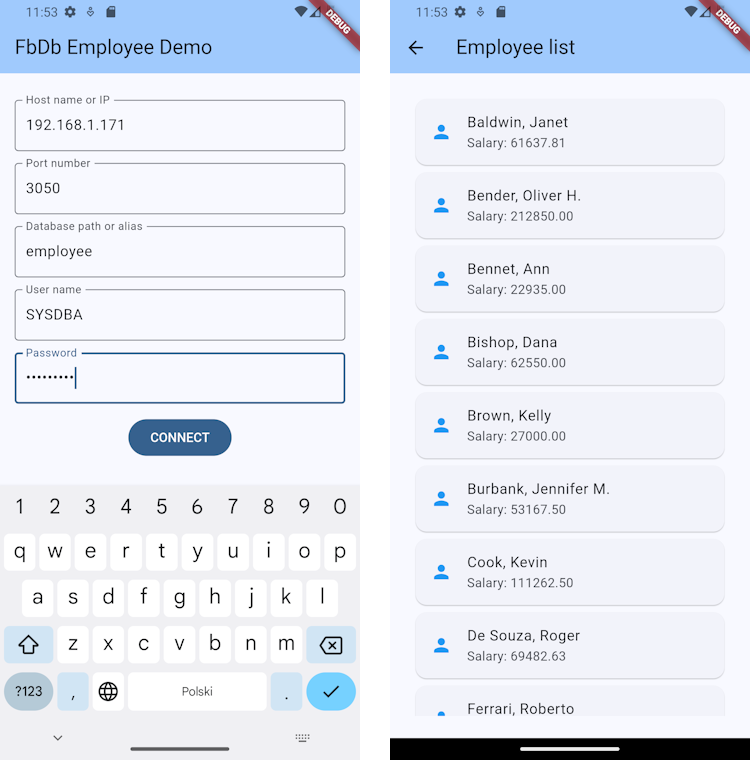

A Dart client for the [Firebird](https://firebirdsql.org) database management system.

Provides a convenient, high-level asynchronous API based on futures, async methods and streams, as well as low-level wrappers around native Firebird client interfaces.

**Requires the availability of the native Firebird client library (depending on the operating system, it's either *fbclient.dll*, *libfbclient.so* or *libfbclient.dylib*), together with its dependencies.**


*Firebird name and logo are registered trademarks of the [Firebird Foundation](https://www.firebirdsql.org/firebird-foundation), used with permission.*

**TABLE OF CONTENTS**
<!-- vscode-markdown-toc -->
* 1. [Features](#Features)
* 2. [Getting started](#Gettingstarted)
	* 2.1. [Documentation and resources](#Documentationandresources)
	* 2.2. [Generating API docs](#GeneratingAPIdocs)
* 3. [Usage example](#Usageexample)
* 4. [Additional information](#Additionalinformation)
	* 4.1. [Issues](#Issues)
	* 4.2. [Contributing](#Contributing)
	* 4.3. [Commercial support](#Commercialsupport)
	* 4.4. [Roadmap](#Roadmap)

<!-- vscode-markdown-toc-config
	numbering=true
	autoSave=true
	/vscode-markdown-toc-config -->
<!-- /vscode-markdown-toc -->


##  1. <a name='Features'></a>Features
- Fully asynchronous communication with [Firebird](https://firebirdsql.org) databases, making it an ideal fit for Flutter GUI applications, as well as server-side Dart applications.

- Two alternative APIs to choose from: a high-level, Dart-idiomatic library or low-level native Firebird client bindings.

- Makes use of advanced Dart concepts: isolates, streams, futures and FFI, at the same time exposing a simple and convenient interface to the application developers.

- Supports database transactions and BLOBs.

- Calls native functions from the official  Firebird client dynamic library.

- Free to use and open-source ([BSD-3 license](https://github.com/hipercompl/fbdb/blob/main/LICENSE)).

There is also a simple Android Flutter demo application available in a [separate Github repository](https://github.com/hipercompl/fbdbmobdemo).



##  2. <a name='Gettingstarted'></a>Getting started

###  2.1. <a name='Documentationandresources'></a>Documentation and resources

It is highly recommended to get familiar with the [FbDb Programmers Guide](https://github.com/hipercompl/fbdb/blob/main/doc/fbdb_guide.md) and [FbDb Architecture Overview](https://github.com/hipercompl/fbdb/blob/main/doc/fbdb_arch.md). 

Should you need to go low-level and interact directly with Firebird interfaces, the [FBClient Programmer's Guide](https://github.com/hipercompl/fbdb/blob/main/doc/fbclient_guide.md) may also prove helpful.

In order for your applications using FbDb to work, you need to install the firebird **native client library** or bundle it together with your application executable. That usually means the proper shared libraries for the target operating system should be placed in an appropriate location in the file system (see the [FbDb Programmers Guide](https://github.com/hipercompl/fbdb/blob/main/doc/fbdb_guide.md) for more details). The aforementioned shared libraries are **fbclient.dll** on Windows, **libfbclient.so** on Linux and **libfbclient.dylib** on MacOS, plus their own **dependencies** (e.g. on Windows the Visual C++ runtime libraries are requred - please refer to the official [Firebird client installation guide](https://firebirdsql.org/file/documentation/html/en/firebirddocs/qsg5/firebird-5-quickstartguide.html#qsg5-installing-client) for more information).

To learn how to use the library, take a look at the simple usage example below, read the aforementioned [FbDb Programmers Guide](https://github.com/hipercompl/fbdb/blob/main/doc/fbdb_guide.md), and get some practise by following the [FbDb Tutorial](https://github.com/hipercompl/fbdb/blob/main/doc/fbdb_tutorial.md). You may also be interested in some [examples](https://github.com/hipercompl/fbdb/tree/main/example).

###  2.2. <a name='GeneratingAPIdocs'></a>Generating API docs
To generate API documentation, clone the repository and run
```bash
dart doc
```
in the root directory of the cloned repo. The generated API documentation will be placed in the `docs/API` subdirectory.

##  3. <a name='Usageexample'></a>Usage example
The Firebird server installation comes with a ready to use, example database: **employee**.

To get a taste of FbDb, we'll write a short CLI (console-mode) application to display the names of the first 10 employees from the `EMPLOYEE` table of the `employee` database. 

**Before** executing the example code below, provide a valid **host**, **user name** and **password** in place of the defaults in the code.

Start a new Dart console project
```bash
dart create -t console fbdbtestproj
```

and change the implementation to read:

```dart
import "package:fbdb/fbdb.dart";

void main() async {
  FbDb db = await FbDb.attach(
    host: "localhost",
    database: "employee",
    user: "SYSDBA",
    password: "masterkey",
  );
  final q = db.query();
  await q.openCursor(
      sql: "select FIRST_NAME, LAST_NAME "
          "from EMPLOYEE "
          "order by LAST_NAME "
          "rows 10 ",
  );
  await for (var r in q.rows()) {
    print("${r['LAST_NAME']}, ${r['FIRST_NAME']}");
  }
  await q.close();
  await db.detach();
}
```

Add FbDb as the project dependency:
```bash
dart pub add fbdb
```

copy the Firebird client library (on Windows it would mean fbclient.dll and its dependencies: msvcp140.dll and vcruntime140.dll) to the project directory and run the example:

```bash
dart run
```

You should see a list of 10 employee names in your console (or an error message if something went wrong):
```
Baldwin, Janet
Bender, Oliver H.
Bennet, Ann
Bishop, Dana
Brown, Kelly
Burbank, Jennifer M.
Cook, Kevin
De Souza, Roger
Ferrari, Roberto
Fisher, Pete
```

##  4. <a name='Additionalinformation'></a>Additional information

###  4.1. <a name='Issues'></a>Issues
Please report issues via Github Issues in the [Github repository](https://github.com/hipercompl/fbdb/issues) of the package.

###  4.2. <a name='Contributing'></a>Contributing
Currently, I'm still working on completing the core functionality I'd like to be included in the library (see the roadmap below), and to improve test coverage.

Therefore, at this moment, **I don't accept** pull requests.

However, you're most welcome to provide additional **tutorials**, **examples** and **guides**, to help other users get familiar with the library (I'd be happy to put links to them here), as well as to **report any bugs** you discover, to improve the quality of the library.

###  4.3. <a name='Commercialsupport'></a>Commercial support
If you need specific commercial support of FbDb, please contact the author (fbdb @at@ hipercom.pl) and something can be worked out.

###  4.4. <a name='Roadmap'></a>Roadmap
The following features are planned for the future releases of FbDb:

- ~~backward compatibility with Firebird 3.0 client library~~ *implemented in version 1.1*,
- ~~more utility methods, similar to selectOne / selectAll (to save typing)~~ *implemented in version 1.2*,
- ~~multiple explicit concurrent transactions~~ *implemented in version 1.4*,
- ~~prepared statements optimized for multiple executions~~ *implemented in version 1.3*,
- support for time with time zone and timestamp with time zone data types,
- abstractions for metadata querying (table structure, constraints, indices, relationships, etc.),
- support for Firebird array types,
- high-level API for Firebird service manager,
- high-level API for Firebird events,
- abstractions for server / database statistics,
- implementation of the Firebird wire protocol to use FbDb without the native client libraries.
